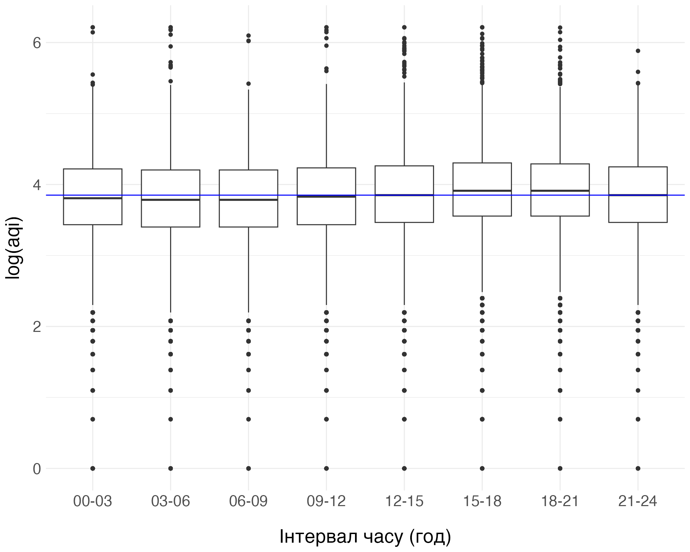
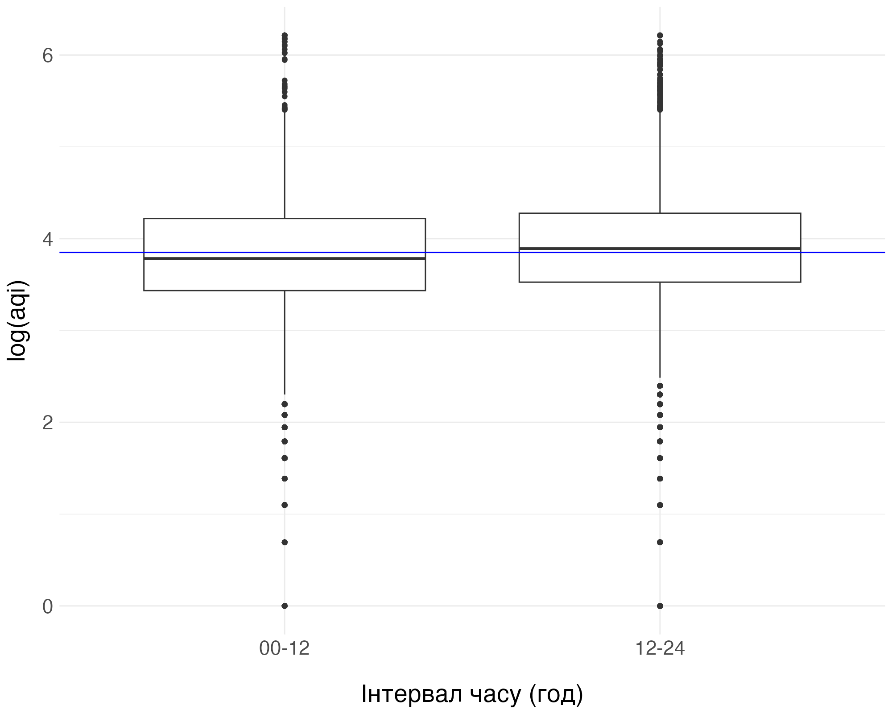
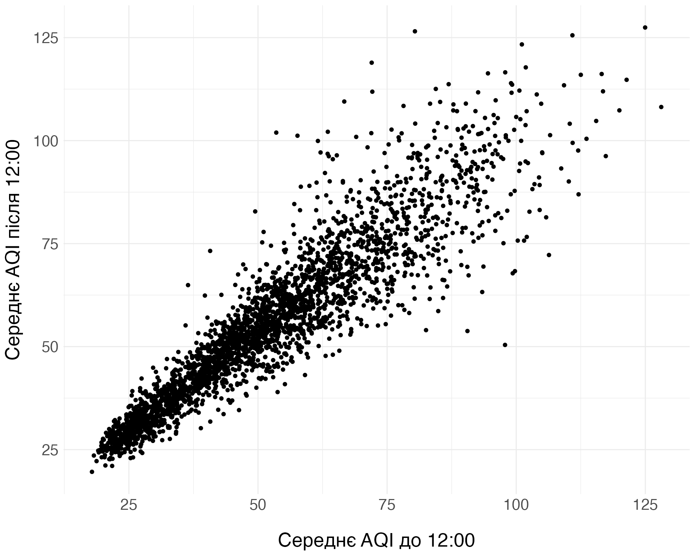
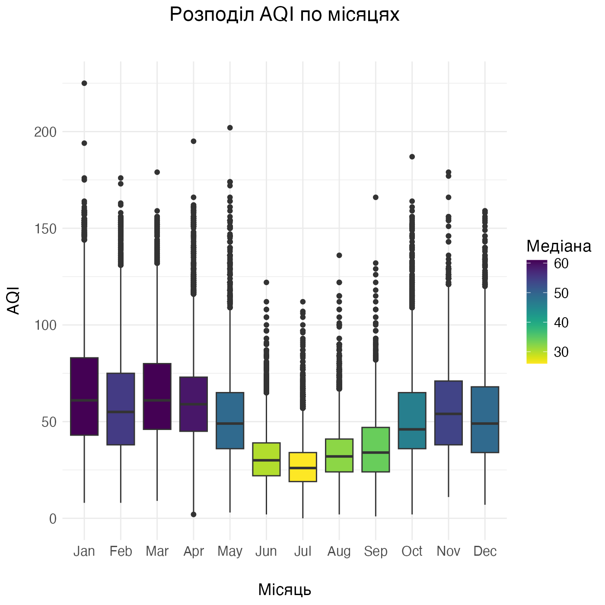
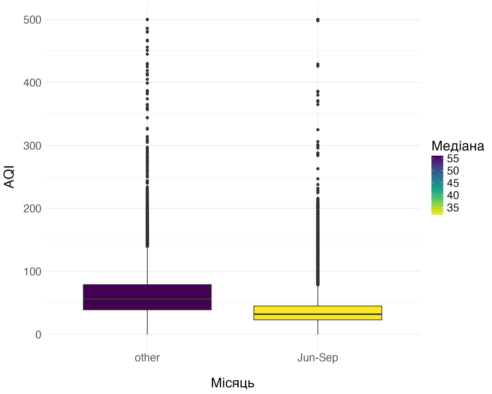
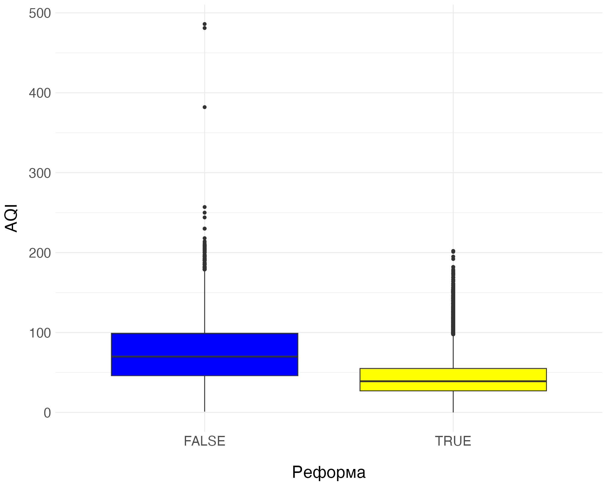

```{r setup, include = FALSE}
library(tidyverse)
library(viridis)
library(here)
library(boot)

theme_set(
  theme_minimal() +
  theme(
    text = element_text(size = 20),
    plot.title = element_text(margin = margin(0, 0, 30, 0), hjust = 0.5),
    axis.title.x = element_text(margin = margin(20, 0, 0, 0)),
    axis.title.y = element_text(margin = margin(0, 10, 0, 0))
  )
)

dir.create(here("plots", "lab2", "hypotheses"), recursive = TRUE, showWarnings = FALSE)
```

Для тестування гіпотез використовується тест Волда:

```{r define_wald}
wald <- function(theta_hat, theta_0, se_theta_hat, alternative, a) {
  difference = theta_hat - theta_0
  T_stat <- difference / se_theta_hat
  
  if (alternative == "two.sided") {
    p_value <- 2 * pnorm(T_stat)
    conf_int <- c(
      difference - qnorm(1 - a / 2) * se_theta_hat,
      difference + qnorm(1 - a / 2) * se_theta_hat
    )
  } else if  (alternative == "greater") {
    p_value <- pnorm(T_stat, lower.tail = FALSE)
    conf_int <- c(difference - qnorm(1 - a) * se_theta_hat, Inf)
  } else if  (alternative == "less") {
    p_value <- pnorm(T_stat)
    conf_int <- c(-Inf, difference + qnorm(1 - a) * se_theta_hat)
  } else {
    stop(paste("Unknown alternative hypothesis:", alternative, sep=" "))
  }
  
  c(t = T_stat,  p_value = p_value, conf_int = conf_int)
}
```

## Гіпотеза 1 -- Зміни aqi впродовж доби

Під час виконання лаб1 було помічено, що у другій половині дня aqi трохи вище, ніж у першій. Перевіримо, чи є ця різниця статистично значущою.

```{r load_daytime, include = FALSE}
df <- readRDS(here("data", "processed", "air_quality_tidy.RDS"))

df <- df %>% select(date, aqi, after_reform) %>% filter(!is.na(aqi))

df <- df %>%
  mutate(
    date_wo_time = as.Date(date),
    interval_3hr = factor(
      lubridate::hour(date) %/% 3,
      labels = c("00-03", "03-06", "06-09", "09-12", "12-15", "15-18", "18-21", "21-24")
    ),
    interval_12hr = factor(
      lubridate::hour(date) %/% 12,
      labels = c("00-12", "12-24")
    )
  )
```

```{r plot_3hr, include = FALSE}
p <- df %>%
  ggplot(aes(x = interval_3hr, y = log(aqi))) +
    geom_boxplot(na.rm = TRUE) +
    geom_hline(yintercept = log(median(df$aqi, na.rm=TRUE)), color="blue") +
    labs(x = "Інтервал часу (год)")

ggsave(
  here("plots", "lab2", "hypotheses", "daytime_3hr_vs_aqi.png"), p,
  bg = "white", dpi = 200, width = 10, height = 8
)
```

```{r plot_12hr, include = FALSE}
p <- df %>%
  ggplot(aes(x = interval_12hr, y = log(aqi))) +
    geom_boxplot(na.rm = TRUE) +
    geom_hline(yintercept = log(median(df$aqi, na.rm=TRUE)), color="blue") +
    labs(x = "Інтервал часу (год)")

ggsave(
  here("plots", "lab2", "hypotheses", "daytime_12hr_vs_aqi.png"), p,
  bg = "white", dpi = 200, width = 10, height = 8
)
```

{width=49%} {width=49%}

### Тестування

Розглянемо дві популяції:

* X - середнє aqi за I половину доби
* Y - середнє aqi за II половину доби

Вважати, що X і Y є незалежними було б некоректно. Якість повітря в I половині доби явно має впливати на якість повітря в II половині доби.

```{r group_by_day, include = FALSE}
df_by_day <- df %>%
  group_by(date_wo_time, interval_12hr) %>%
  summarize(avg = mean(aqi)) %>% 
  spread(key = interval_12hr, value = avg) %>% 
  filter(!is.na(`00-12`) & !is.na(`12-24`))
```

```{r plot_00_12_vs_12_24, include = FALSE}
p <- df_by_day %>%
  ggplot(aes(x = `00-12`, y = `12-24`)) +
  geom_point() +
  labs(x = "Середнє AQI до 12:00", y = "Середнє AQI після 12:00")

ggsave(
  here("plots", "lab2", "hypotheses", "aqi_00_12_vs_12_24.png"), p,
  bg = "white", dpi = 200, width = 10, height = 8
)
```

{width=49%}

Тому працюватимемо з відповідними вибірками, як з парованими. Для кожного i-го спостереження порахуємо різницю:

$$D_i = X_i - Y_i$$

```{r paired}
df_by_day <- df_by_day %>% mutate(di = `00-12` - `12-24`)
```

Нас цікавить статистика $\theta = \mu_D$. Її оцінкою є вибіркове середнє $\hat{\theta} = \bar{D}$. Відомо, що вибіркове середнє асимптотично має нормальний розподіл:

$$\bar{D} \overset{a}{\sim} N(\mu_D, \frac{{\mathrm Var}(\bar{D})}{n})$$

Отже, для тестування гіпотез щодо $\theta$ можна використати тест Волда.

$H_0: \theta ≥ 0$ vs. $H_1: \theta < 0$  
$H_0: \mu_{X_i - Y_i} ≥ 0$ vs. $H_1: \mu_{X_i - Y_i} < 0$

```{r wald_daytime}
theta_hat = mean(df_by_day$di)
se_theta_hat <- sqrt(var(df_by_day$di) / nrow(df_by_day))

theta_hat
wald(theta_hat, 0, se_theta_hat, alternative = "less", a = 0.05)
```

Отримали низьке $p-value$ і довірчий інтервал, який не включає нуль, тому відкидаємо гіпотезу $H_0$. Це приклад того, коли різниця медіан є статистично значущою, проте її значення, насправді дуже мале.

## Гіпотеза 2 -- Зменшення aqi влітку

Також ми спостерігали зниження рівня aqi у період з червня до вересня.

```{r load_season, include = FALSE}
df <- df %>%
  mutate(
    season = factor(
      6 <= lubridate::month(date) & lubridate::month(date) <= 9,
      labels = c("other", "Jun-Sep")
    )
  ) %>% 
  mutate(  # just for visualization
    aqi_season_median = median(aqi, na.rm = TRUE),
    .by = season
  )
```

```{r plot_season, include = FALSE}
p <- df %>%
  ggplot(aes(x = season, y = aqi, fill = aqi_season_median)) +
  geom_boxplot() +
  labs(x = "Місяць", y = "AQI") + 
  scale_fill_viridis(option = "viridis", name = "Медіана", direction = -1)

ggsave(
  here("plots", "lab2", "hypotheses", "season_vs_aqi.png"), p,
  bg = "white", dpi = 200, width = 10, height = 8
)
```

{width=49%} {width=49%}

### Тестування

Розглянемо дві популяції:

* X - aqi від червня до вересня
* Y - aqi в інший час

Припустимо, що X і Y незалежні.  

Нас цікавить різниця медіан $\theta = Me_X - Me_Y$. Їхніми оцінками $\hat{Me}_X$ і $\hat{Me}_Y$ будуть вибіркові медіани.  

Обидві оцінки асимптотчно мають нормальний розподіл:

$$\hat{Me}_i \overset{a}{\sim} N(\mu_i, \frac{1}{4nf(m)^2});i = X, Y$$
де $n$ -- розмір вибірки, $f(x)$ -- щільність розподілу популяції, $m$ -- медіана $f(x)$.  

Оцінка різниці медіан $\hat{\theta} = \hat{Me}_X - \hat{Me}_Y$, теж асимптотично матиме нормальний розподіл, тому для тестування гіпотез можна використати тест Волда.  

Проте, не знаючи $f(x)$, ми не зможемо порахувати дисперсію вибіркової медіани за наведеною формулою. Замість неї застосуємо бутстреп. Бутстреп-вибірки X* і Y* будуть генеруватися незалежно одна від одної, оскільки раніше ми припустили, що вони незалежні.  

```{r boot_define}
median_diff <- function(data, indices, gp_col, x_gp_lab, y_gp_lab) {
  medians <- data[indices,] %>% group_by_at(gp_col) %>% summarize(med = median(aqi))
  
  med_x <- medians %>% filter_at(gp_col, any_vars(. == x_gp_lab)) %>% pull(med)
  med_y <- medians %>% filter_at(gp_col, any_vars(. == y_gp_lab)) %>% pull(med)
  
  return(med_x - med_y)
}

var_median_diff <- function(data, indices, gp_col, x_gp_lab, y_gp_lab) {
  d <- data[indices,]
  
  boot_out <- boot(  # generate an array of median diffs
    d, statistic = median_diff, R = 100, strata = d[[gp_col]],
    gp_col = gp_col, x_gp_lab = x_gp_lab, y_gp_lab = y_gp_lab
  )
  
  return(var(boot_out$t[,1]))  # return the median diff variance
}

boot_var_median_diff <- function(data, grouping_col, x_group_label, y_group_label) {
  boot_out <- boot(  # generate an array of median diff variances
    data, statistic = var_median_diff, R = 100, strata = data[[grouping_col]],
    gp_col = grouping_col, x_gp_lab = x_group_label, y_gp_lab = y_group_label
  )
  
  return(boot_out$t0)  # return the observed value of median diff variance
}
```

Розмір вибірки було зменшено до 10000 рядків у цілях економії часу на обчислення.

```{r sample_season}
set.seed(0)
df_sampled <- df %>% sample_n(10000)
```

```{r boot_season}
var_theta_hat <- boot_var_median_diff(
  data = df_sampled,
  grouping_col = "season",
  x_group_label = "Jun-Sep",
  y_group_label = "other"
)

var_theta_hat
```

Маючи оцінку $\mathrm Var(\hat{\theta})$, перейдемо до тестування.  

$H_0: \theta ≥ 0$ vs. $H_1: \theta < 0$  
$H_0: Me_X - Me_Y ≥ 0$ vs. $H_1: Me_X - Me_Y < 0$

```{r wald_season}
estimates <- df_sampled %>% group_by(season) %>% summarize(med_hat = median(aqi))

med_hat_summer <- estimates %>% filter(season == "Jun-Sep") %>% pull(med_hat)
med_hat_other <- estimates %>% filter(season == "other") %>% pull(med_hat)

theta_hat = med_hat_summer - med_hat_other
se_theta_hat <- sqrt(var_theta_hat)

med_hat_summer
med_hat_other
wald(theta_hat, 0, se_theta_hat, alternative = "less", a = 0.05)
```

Отримали дуже низьке $p-value$ і довірчий інтервал, який не включає нуль, тому відкидаємо гіпотезу $H_0$. Різниця медіан є статистично значущою, і її значення, на відміну від попереднього випадку, суттєве.

## Гіпотеза 3 -- Вплив реформи на aqi

Одним із головних питань EDA було, чи вплинула реформа на якість повітря. Візуалізація розподілів aqi за періоди часу до 2017-05-25 (до введення реформи) і після 2024-03-15 (найновіші дані) створює підстави для оптимізму.

```{r load_reform, include = FALSE}
df <- df %>% filter(!(as.Date("2017-05-25") < date & date < as.Date("2024-03-15")))
```

```{r plot_reform, include = FALSE}
p <- df %>%
  ggplot(aes(x = after_reform, y = aqi, fill = after_reform)) +
  geom_boxplot() +
  labs(x = "Реформа", y = "AQI") +
  scale_fill_manual(values = c("blue", "yellow"), guide = "none")

ggsave(
  here("plots", "lab2", "hypotheses", "reform_vs_aqi.png"), p,
  bg = "white", dpi = 200, width = 10, height = 8
)
```

{width=49%}

### Тестування

Розглянемо дві популяції:

* X - aqi до 2017-05-25
* Y - aqi після 2024-03-15

Аналогічно попередньому прикладу припустимо, що вони незалежні, і будемо досліджувати різницю медіан $\theta = Me_X - Me_Y$.  

Спочатку знайдемо $\mathrm Var(\hat{\theta})$ за допомогою бутстреп.

```{r sample_reform}
set.seed(0)
df_sampled <- df %>% sample_n(10000)
table(df_sampled$after_reform)
```

```{r boot_reform}
var_theta_hat <- boot_var_median_diff(
  data = df_sampled,
  grouping_col = "after_reform",
  x_group_label = FALSE,
  y_group_label = TRUE
)

var_theta_hat
```

Протестуємо гіпотезу.  

$H_0: \theta ≤ 0$ vs. $H_1: \theta > 0$  
$H_0: Me_X - Me_Y ≤ 0$ vs. $H_1: Me_X - Me_Y > 0$

```{r wald_reform}
estimates <- df_sampled %>% group_by(after_reform) %>% summarize(med_hat = median(aqi))

med_hat_before <- estimates %>% filter(after_reform == FALSE) %>% pull(med_hat)
med_hat_after <- estimates %>% filter(after_reform == TRUE) %>% pull(med_hat)

theta_hat = med_hat_before - med_hat_after
se_theta_hat <- sqrt(var_theta_hat)

med_hat_before
med_hat_after
wald(theta_hat, 0, se_theta_hat, alternative = "greater", a = 0.05)
```

Отримали дуже низьке $p-value$ і довірчий інтервал, який не включає нуль. Відкидаємо гіпотезу $H_0$ про те, що з реформою нічого не змінилося або стало гірше. Різниця медіан є статистично значущою.